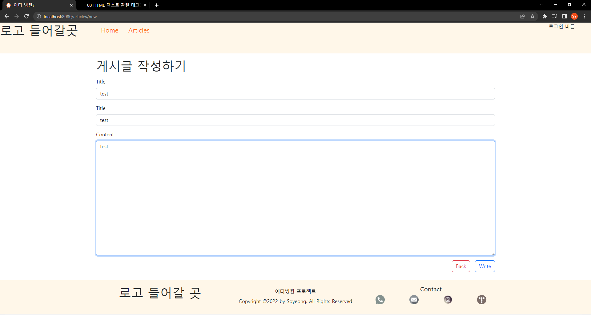
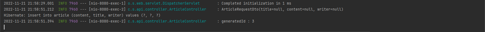
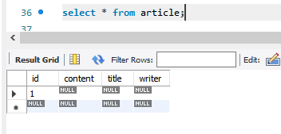
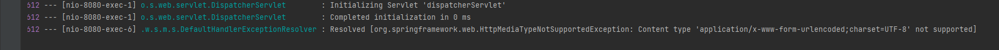
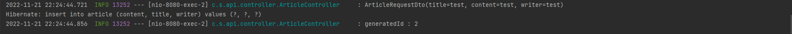
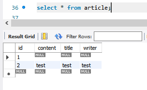

# 22.11.18 회고

### ✅ 발생한 에러





게시글 작성하기 기능 구현 중 RequestDto 객체에 데이터가 온전히 담기지 않고 null로 넘어오는 것을 확인



DB 역시 AutoIncreament 설정이 되어있는 id 외의 컬럼들에 모두 null 값이 들어갔음을 확인

<br />

<br />

### 💡 해결 과정

#### 1️⃣ 첫 번째 시도

ArticleController의 register()의 매개변수에 `@RequestBody` 선언

**👇 ArticleController.java**

```Java
package com.springboot.api.controller;

import com.springboot.api.domain.dto.ArticleRequestDto;
import com.springboot.api.domain.entity.Article;
import com.springboot.api.repository.ArticleRepository;
import lombok.extern.slf4j.Slf4j;
import org.springframework.stereotype.Controller;
import org.springframework.web.bind.annotation.GetMapping;
import org.springframework.web.bind.annotation.PostMapping;
import org.springframework.web.bind.annotation.RequestBody;
import org.springframework.web.bind.annotation.RequestMapping;

@Controller
@Slf4j
@RequestMapping("/articles")
public class ArticleController {

    private final ArticleRepository articleRepository;

    public ArticleController(ArticleRepository articleRepository) {
        this.articleRepository = articleRepository;
    }

    @GetMapping("/new")
    public String registerPage() {
        return "articles/register";
    }

    @PostMapping()
    public String register(@RequestBody ArticleRequestDto articleRequestDto) {
        log.info(articleRequestDto.toString());
        Article savedArticle = articleRepository.save(articleRequestDto.toEntity());
        log.info("generatedId : {}", savedArticle.getId());
        return "";
    }
}
```

**👇 register.mustache **

```html
{{> layouts/header}}
<div id="wrapper" class="container mt-3">
    <div id="pageTitle">
        <h1>게시글 작성하기</h1>
    </div>
    <form class="mt-3" action="/articles" method="post">
        <div class="form-group mb-3">
            <label for="titleInput" class="form-label">Title</label>
            <input type="text" class="form-control" name="title" id="title" placeholder="제목을 작성해주세요.">
        </div>
        <div class="form-group mb-3">
            <label for="writerInput" class="form-label">Title</label>
            <input type="text" class="form-control" name="writer" id="writer" placeholder="작성자를 작성해주세요.">
        </div>
        <div class="form-group mb-3">
            <label for="contentInput" class="form-label">Content</label>
            <textarea class="form-control" id="content" name="content" rows="20" placeholder="내용을 작성해주세요."></textarea>
        </div>
        <div class="d-flex justify-content-end">
            <button class="btn btn-outline-danger me-3" onclick="href='#'">Back</button>
            <button type="submit" class="btn btn-outline-primary">Write</button>
        </div>
    </form>
</div>
{{> layouts/footer}}
```


#### 😡 실행 결과 



<mark style="color:red;">Resolved [org.springframework.web.HttpMediaTypeNotSupportedException: Content type 'application/x-www-form-urlencoded;charset=UTF-8' not supported]</mark> 에러 발생

<br />

<br />

#### 2️⃣ 두 번째 시도

ArticleRequestDto에 `@Setter` 선언

**👇 ArticelRequestDto.java**

```Java
package com.springboot.api.domain.dto;

import com.springboot.api.domain.entity.Article;
import lombok.*;

@Getter
@Setter
@NoArgsConstructor
@ToString
public class ArticleRequestDto {
    private String title;
    private String content;
    private String writer;

    public ArticleRequestDto(String title, String content, String writer) {
        this.title = title;
        this.content = content;
        this.writer = writer;
    }

    public Article toEntity() {
        return new Article(this.title, this.content, this.writer);
    }
}
```

**👇 ArticleController.java**

```java
package com.springboot.api.controller;

import com.springboot.api.domain.dto.ArticleRequestDto;
import com.springboot.api.domain.entity.Article;
import com.springboot.api.repository.ArticleRepository;
import lombok.extern.slf4j.Slf4j;
import org.springframework.stereotype.Controller;
import org.springframework.web.bind.annotation.GetMapping;
import org.springframework.web.bind.annotation.PostMapping;
import org.springframework.web.bind.annotation.RequestBody;
import org.springframework.web.bind.annotation.RequestMapping;

@Controller
@Slf4j
@RequestMapping("/articles")
public class ArticleController {

    private final ArticleRepository articleRepository;

    public ArticleController(ArticleRepository articleRepository) {
        this.articleRepository = articleRepository;
    }

    @GetMapping("/new")
    public String registerPage() {
        return "articles/register";
    }

    @PostMapping()
    public String register(ArticleRequestDto articleRequestDto) {
        log.info(articleRequestDto.toString());
        Article savedArticle = articleRepository.save(articleRequestDto.toEntity());
        log.info("generatedId : {}", savedArticle.getId());
        return "redirect:articles/list";
    }
}
```


#### 😊 실행 결과



ArticleRequestDto에 모든 값이 잘 담기는 것을 확인



DB 역시 값이 모두 잘 담기는 것을 확인