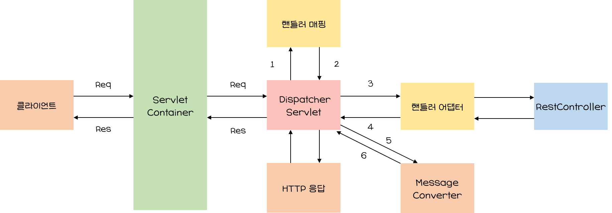
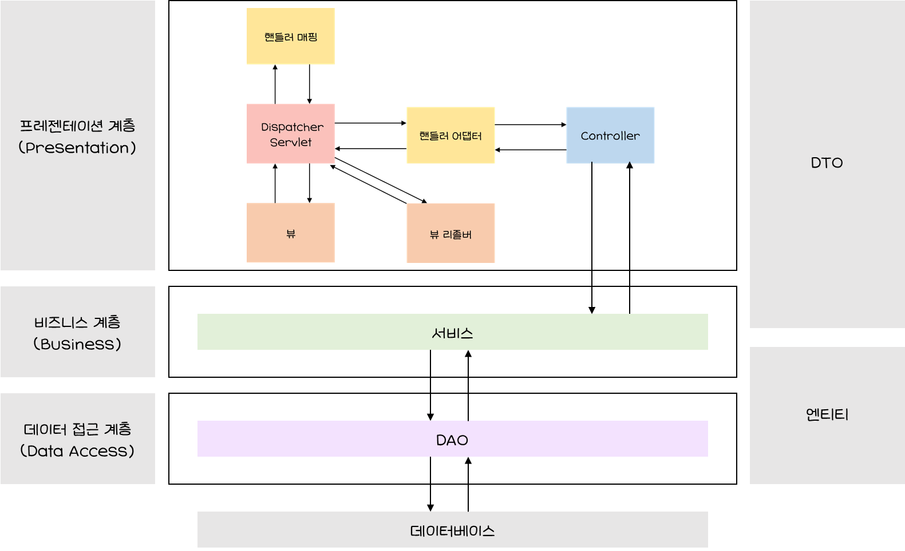

# 2️⃣ 개발에 앞서 알면 좋은 기초 지식

 

###  서버 간 통신

##### MSA (Microservice Architecture)

- 서비스 규모를 작게 나누어 구성한 아키텍처

- 애플리케이션을 기능별로 나누어 개발함으로써 유지보수에 용이하도록 하는 방식

##### 서버 간 통신

- 한 서버가 다른 서버에 통신을 요청하는 것 👉 한 대는 서버, 다른 한 대는 클라이언트가 되는 구조
- 주로 HTTP/HTTPS 프로토콜을 이용한 방식을 적용

 

 

### Servlet과 Servlet Container

##### Servlet

- 클라이언트의 요청을 처리하고 결과를 반환하는 자바 웹 프로그래밍 기술
- Servlet Container에서 관리

##### Servlet Container

- Servlet Instance를 생성, 초기화, 호출, 종료하는 생명주기를 관리하는 역할을 수행하는 주체
- Servlet 객체는 싱글톤 패턴으로 관리
- 멀티 스레딩 지원

 

 

### 스프링 부트의 동작 방식

1️⃣ 요청을 받은 DispatcherServlet으로 요청(HttpServletRequest)이 들어오면 DispatcherServlet은 핸들러 매핑(Handler Mapping)을 통해 요청 URI에 매핑된 핸들러(Controller)를 탐색

2️⃣ 핸들러 매핑에서 요청 정보를 기준으로 어떤 컨트롤러를 사용할지 선정하고 이에 관한 요청을 DispatcherServlet에 전달

핸들러 매핑 인터페이스 구현체 (👇 펼치기)

<pre>
    ✔ BeanNameUrlHandlerMapping
    	빈 이름을 URL로 사용하는 매핑 전략
        빈을 정의할 때 슬래시('/')가 들어가면 매핑 대상이 됨
    ✔ ControllerClassNameHandlerMapping
    	URL과 일치하는 클래스 이름을 갖는 빈을 컨트롤러로 사용하는 전략
    	이름 중 Controller를 제외하고 앞부분에 작성된 suffix를 소문자로 매핑
    ✔ SimpleUrlHandlerMapping
    	URL 패턴에 매핑된 컨트롤러를 사용하는 전략
    ✔ DefaultAnnotationHandlerMapping
    	어노테이션으로 URL과 컨트롤러를 매핑하는 방법
</pre>

3️⃣ 핸들러 어댑터에 컨트롤러의 응답이 돌아오면 ModelAndView로 응답을 가공

4️⃣ 가공된 ModelAndView를 DispatcherServlet으로 반환

5️⃣ MessageConverter 인터페이스를 통해 요청에 대한 Body 값을 JSON형식으로 변환

6️⃣변환한 JSON 객체를 HTTP 응답에 담아 DispatcherServlet과 ServletContainer로 반환되어 클라이언트에게 데이터 전달

 

 

### 레이어드 아키텍처

##### 레이어드 아키텍처(Layered Architecture)

- 애플리케이션의 컴포넌트를 유사 관심사를 기준으로 레이어로 묶어 수평적으로 구성한 구조를 의미

 

##### 레이어드 아키텍처 기반 설계의 특징

- 각 레이어는 가장 가까운 하위 레이어의 의존성을 주입받음
- 각 레이어는 관심사에 따라 묶여 있으며, 다른 레이어의 역할을 침범하지 않음
  - 각 컴포넌트의 역할이 명확하므로 코드의 가독성과 기능 구현에 유리
  - 코드의 확장성이 좋아짐
- 각 레이어가 독립적으로 작성되면 다른 레이어와의 의존성을 낮춰 단위 테스트에 용이

 

##### Spring Boot와 레이어드 아키텍처 기반 설계

- Spring MVC의 View와 Contoller는 프레젠테이션 계층 영역이며, Model은 비즈니스와 데이터 접근 계층의 영역으로 구분

- 프레젠테이션 계층

  👉 상황에 따라 유저 인터페이스(UI; User Interface) 계층이라고도 함

  👉 클라이언트와의 접점

  👉 클라이언트로부터 데이터와 함께 요청을 받고 처리 결과를 응답으로 전달하는 역할

- 비즈니스 계층

  👉 상황에 따라 서비스(Service) 계층이라고도 함

  👉  핵심 비즈니스 로직을 구현하는 영역

  👉 트랜잭션 처리나 유효성 검사 등의 작업도 수행

- 데이터 접근 계층

  👉 상황에 따라 영속(Persistence) 계층이라고도 함

  👉 데이터베이스에 접근해야 하는 작업을 수행

  👉 Spring Data JPA에서는 Repository가 해당 역할을 수행하여 대체

 

 

### REST API

##### REST(Representational State Transfer)란?

- 주고받는 자원(Resource)에 이름을 규정하고 URI에 명시해 HTTP메서드(GET, POST, PUT, DELETE)를 통해 해당 자원의 상태를 주고받는 것을 의미

 

#####  REST API란?

- API(Application Programming Interface) : 애플리케이션에서 제공하는 인터페이스를 의미하며, 서버 또는 프로그램 사이를 연결하는 역할
- REST API : REST 아키텍처를 따르는 시스템/애플리케이션 인터페이스
- RESTful 하다 = REST 아키텍처를 구현하는 웹 서비스

 

##### REST의 특징

- 유니폼 인터페이스

  👉 REST 서버는 HTTP표준 전송 규약을 따르기 때문에 플랫폼 및 기술에 종속되지 않고 타 언어, 플랫폼, 기술 등과 호환해 사용할 수 있음

- 무상태성 (Stateless)

  👉 서버에 상태 정보와 같은 불필요한 정보를 따로 보관하거나 관리하지 않으므로 비즈니스 로직의 자유도가 높고 설계가 단순 

- 캐시 가능성

  👉 HTTP의 캐싱 기능을 적용함으로써 서버의 트랜잭션 부하가 줄어 효율적이며 사용잦 입장에서 성증이 개선됨

- 레이어 시스템

  👉 REST 서버는 네트워크 상의 여러 계층으로 구성될 수 있고, 서버의 복잡도와 관계없이 클라이언트는 서버와 연결되는 포인트만 알면 됨

- 클라이언트-서버 아키텍처

  👉 REST 서버는 API를 제공하고 클라이언트는 사용자 정보를 관리하는 구조로 분리해 설계함으로써, 서로에 댛나 의존성을 낮춤

 

##### REST의 URI 설계 규칙

✔ URI의 마지막에는 '/' 포함 ❌

✔ 리소스의 이름이 길어질 때는 언더바(_)가 아닌 하이픈(-) 이용

✔ URL에는 행위(동사)가 아닌 결과(명사)를 포함

​	👉 행위는 HTTP 메서드로 표현 가능해야 함

✔ URI는 소문자로 작성

​	👉 RFC3986과 같은 일부 웹 서버의 운영체제는 리소스 경로 부분의 대소문자를 다른 문자로 인식하기 때문

✔ 파일의 확장자는 URI에 포함 ❌

​	👉 대신 HTTP에서 제공하는 Accept 헤더 사용 권장

